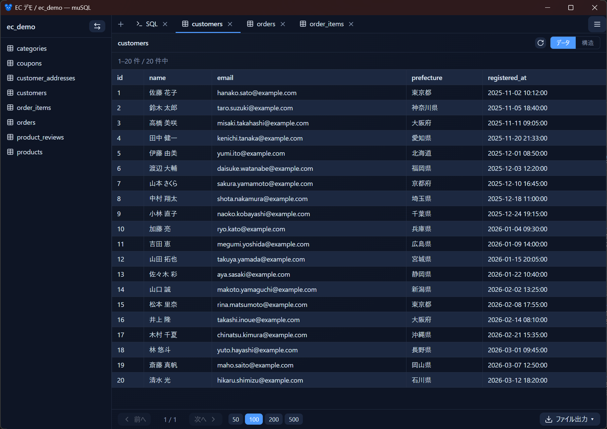

# muSQL ユーザーマニュアル

muSQL は **Windows 向けの軽量な MySQL クライアント**です。Tauri v2 + Rust で作られており、SSH 踏み台、Docker コンテナ接続、AI アシスト、エクスポートなどをシンプルな 1 画面の UI にまとめています。

このマニュアルは muSQL の使い方を機能ごとにまとめたものです。はじめての方は [はじめに](getting-started.md) から読んでください。

<!-- 撮影: query 画面。左にテーブル一覧、中央に Data タブ（結果テーブルが数十行）、上部にタブが 2〜3 枚ある状態。ダークテーマ。 -->

## 目次

| ページ | 内容 |
|--------|------|
| [はじめに](getting-started.md) | インストール・初回起動・画面構成・最初の接続 |
| [接続プロファイル](connections.md) | プロファイルの作成・編集、グループ、色・タグ、接続テスト、パスワードの保存方針 |
| [SSH 踏み台接続](ssh.md) | SSH bastion 経由の接続、公開鍵 / パスワード認証、SSH Agent、`~/.ssh/config` |
| [Docker 連携](docker.md) | 起動中コンテナの MySQL 自動検出・接続、`musql.*` ラベル |
| [クエリ画面](query.md) | テーブル一覧、Data / Schema / SQL タブ、ページング・ソート・行詳細、SQL 実行、履歴、QuickOpen、完了通知 |
| [AI アシスト](ai-assist.md) | 自然言語からの SQL 生成、プロバイダ設定、チャット履歴 |
| [エクスポート](export.md) | CSV / TSV / SQL / Markdown 出力、文字コード・改行コード、クリップボードコピー |
| [接続の同期](sync.md) | 接続プロファイルを外部 JSON で複数マシン間に同期 |
| [1Password 連携](1password.md) | パスワードの初期取得・更新元として 1Password を使う |
| [設定](settings.md) | テーマ・言語、アップデート、キーボードショートカット一覧 |

## muSQL の考え方（30 秒で把握）

- **接続はプロファイルで管理**：接続先ごとにプロファイルを作り、グループや色、タグで整理します。一覧から選ぶだけで接続できます。
- **踏み台も Docker も同じ入口**：SSH 踏み台経由でも、ローカルの Docker コンテナでも、同じ接続 UI から扱えます。
- **秘密情報は OS の資格情報マネージャーへ**：パスワードや SSH パスフレーズは JSON に平文で残さず、Windows 資格情報マネージャー（keyring）に保存します。都度入力も選べます。
- **クエリ画面はタブ UI**：テーブルの Data / Schema と、自由記述の SQL タブを、同じタブバーで扱います。タブはドラッグで並べ替え、状態は自動保存されます。

## 関連

- インストール、特徴、ビルド方法はリポジトリの [README](../../README.md) を参照してください。
- muSQL の開発（内部構造やコントリビュート）については [CLAUDE.md](../../CLAUDE.md) を参照してください。
