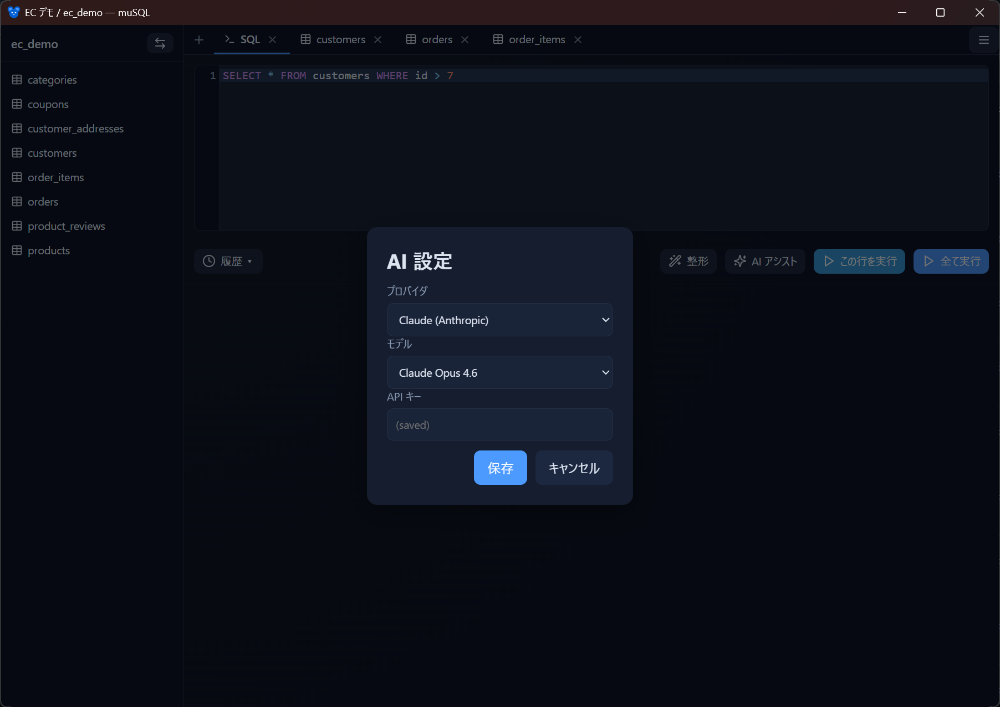
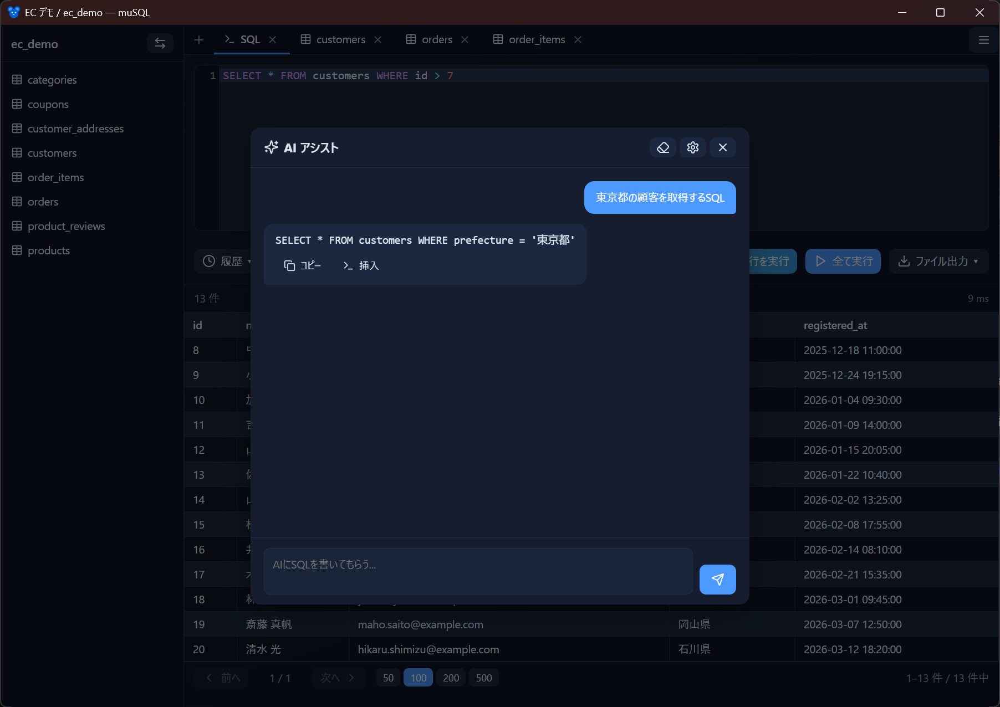

# AI アシスト

自然言語で指示して **SQL を生成** できます。テーブル構造を踏まえた問い合わせを、チャット形式で作れます。

- [設定](#設定)
- [使い方](#使い方)
- [チャット履歴](#チャット履歴)

## 設定

<!-- 撮影: AI 設定モーダル。プロバイダ（Claude / OpenAI / Gemini）とモデルのプルダウン、API キー入力欄。 -->

対応プロバイダは **Claude（Anthropic）/ ChatGPT（OpenAI）/ Gemini（Google）** です。

1. クエリ画面のメニュー、または AI アシストの設定ボタンから設定を開く
2. **プロバイダ** と **モデル** を選ぶ
3. **API キー** を入力する

API キーは Windows 資格情報マネージャーに保存されます。

## 使い方

<!-- 撮影: AI アシストのチャットモーダル。ユーザーの自然言語プロンプトと、生成された SQL（コピー / エディタ挿入ボタン付き）のやり取り。 -->

1. AI アシストを開く
2. やりたいことを日本語（または英語）で入力する（例：「注文テーブルから直近 7 日の売上を日別に集計」）
3. 生成された SQL を確認し、**コピー** または **エディタに挿入** する

スキーマ情報はキャッシュされ、プロンプトに添えて送信されます。これにより、実際のテーブル名やカラム名に沿った SQL が生成されます。

## チャット履歴

チャットのやり取りは **データベースごとに保存**されます（上限あり）。同じ DB を再び開くと履歴が復元されるため、前回の続きから作業できます。履歴はクリアボタンで消去できます。

次のステップ: [クエリ画面](query.md) / [エクスポート](export.md)
