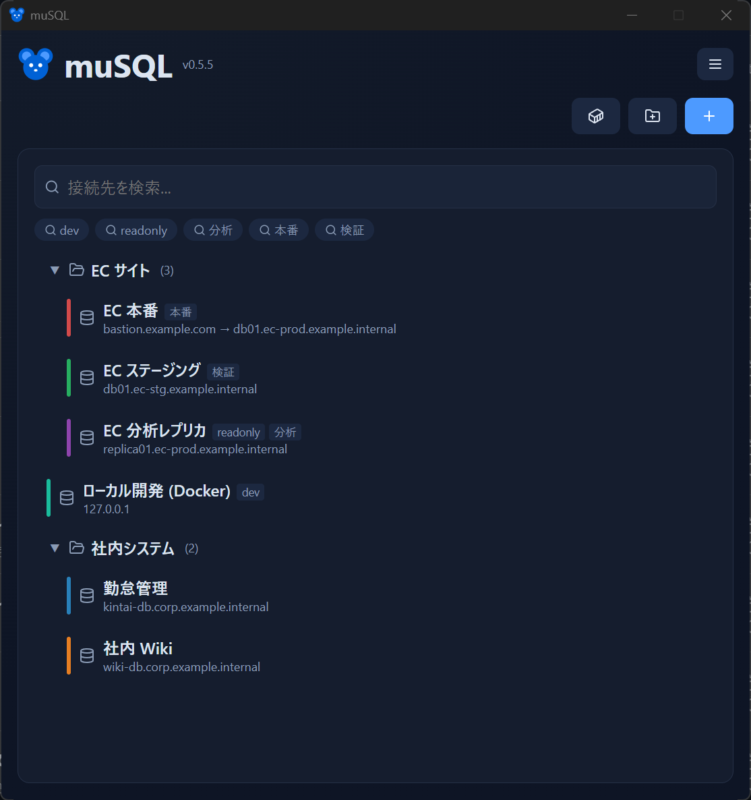

# 接続プロファイル

接続先ごとに **プロファイル** を作って管理します。プロファイルはメイン画面の一覧に並び、クリックするだけで接続できます。

- [プロファイルの作成・編集](#プロファイルの作成編集)
- [接続情報と SSL](#接続情報と-ssl)
- [グループ・色・タグ](#グループ色タグ)
- [接続テスト](#接続テスト)
- [パスワードの保存方針](#パスワードの保存方針)
- [インポート / エクスポート](#インポート--エクスポート)

## プロファイルの作成・編集

<!-- 撮影: 設定ウィンドウ全体。基本情報 + SSL + SSH セクション、下部に「接続テスト」「保存」ボタン。 -->

- **新規作成**：メイン画面の「新規プロファイル」から。
- **編集**：一覧のプロファイルを右クリック →「編集」、またはプロファイルを開いて設定ウィンドウへ。
- **複製 / 削除**：右クリックメニューから。削除時は確認ダイアログが出ます。
- **並べ替え**：一覧上でドラッグして順序を変更できます。

## 接続情報と SSL

| 項目 | 説明 |
|------|------|
| ホスト / ポート | MySQL サーバーのアドレスとポート（既定 3306） |
| ユーザー / パスワード | 認証情報 |
| データベース | 初期選択するデータベース（省略可） |
| SSL モード | `DISABLED` / `REQUIRED` / `VERIFY_CA` / `VERIFY_IDENTITY` |

SSH 踏み台を使う場合は、この基本情報が **踏み台の先（リモート）から見た** MySQL の情報になります。→ [SSH 踏み台接続](ssh.md)

## グループ・色・タグ

接続先が増えても迷わないように整理できます。

- **グループ**：「新規グループ」で作成し、プロファイルをまとめて折りたたみできます。
- **色**：プロファイルに色を付けて、本番 / 検証などを見分けやすくします。
- **タグ**：自由なラベルを付けて分類できます。

<!-- 撮影: メイン画面。グループが1〜2個、プロファイルに色（赤=本番, 緑=検証 など）が付き、タグも見える状態。 -->

## 接続テスト

編集画面の **「接続テスト」** で、保存前に疎通を確認できます。SSH 踏み台や SSL の設定が正しいかをここで確かめられます。テストは実際の接続と同じ経路（踏み台や SSL）を通ります。

## パスワードの保存方針

muSQL は秘密情報を JSON に平文で残しません。各パスワードは **Windows 資格情報マネージャー（keyring）** に保存され、プロファイル本体（`connections.json`）には含まれません。

保存方式は種類ごとに選べます。

| 種類 | 保存する | 都度入力 |
|------|----------|----------|
| MySQL パスワード | 資格情報マネージャーに保存 | 接続前にプロンプト表示 |
| SSH パスフレーズ | 同上 | 同上 |
| SSH パスワード | 同上 | 同上 |

「都度入力」にすると、クエリ画面を開いて接続する直前に入力用モーダルが表示されます。共有 PC などで有効です。

パスワードを 1Password で管理している場合は、資格情報マネージャーへの初期取得と更新を自動化できます。[1Password 連携](1password.md) を参照してください。

## インポート / エクスポート

メイン画面のハンバーガーメニュー（≡）から、プロファイルを JSON で **エクスポート / インポート** できます。

- エクスポート時に **パスワードを含めるかどうか** を選べます。
- インポート時は **重複を検出** し、上書きするか新規として追加するかを選べます。

複数マシンで常に同期したい場合は、Dropbox などの同期フォルダを使う [接続の同期](sync.md) が便利です。

次のステップ: [SSH 踏み台接続](ssh.md) / [Docker 連携](docker.md) / [接続の同期](sync.md) / [1Password 連携](1password.md)
