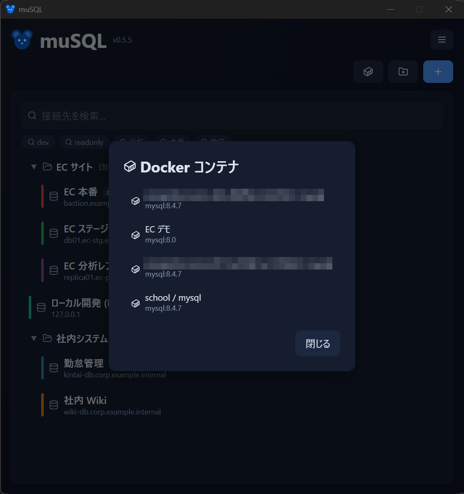

# Docker 連携

ローカルで動いている **Docker コンテナの MySQL** を自動検出して接続できます。接続情報を手で調べる必要はありません。

- [使い方](#使い方)
- [検出の条件](#検出の条件)
- [ポート未公開コンテナへの接続](#ポート未公開コンテナへの接続)
- [`musql.*` ラベルでのカスタマイズ](#musql-ラベルでのカスタマイズ)

## 使い方

<!-- 撮影: メイン画面で Docker ボタンを押した状態。検出された MySQL コンテナが一覧表示され、資格情報入力（user / password / SSL モード）のモーダルが見えると良い。 -->

1. メイン画面の **Docker ボタン** を押す
2. 検出された MySQL コンテナの一覧から選ぶ
3. **ユーザー / パスワード / SSL モード** を入力して接続する

資格情報はコンテナごとに記憶されます（ユーザーと SSL モードはローカル設定、パスワードは資格情報マネージャー）。最後に使った設定は、新しいコンテナにも初期値として適用されます。

> **接続方法**：Docker への接続は、名前付きパイプ → TCP（`127.0.0.1:2375` / `2376`）の順にフォールバックします。WSL2 上の dockerd にも対応します。

## 検出の条件

起動中（running）のコンテナのうち、次のいずれかを満たすものを MySQL コンテナとして検出します。

- **3306 番ポートを公開**している
- **`musql.enable=true`** ラベルが付いている

## ポート未公開コンテナへの接続

ホストにポートをバインドしていないコンテナには、muSQL が一時的な **`alpine/socat` トンネルコンテナ**を作成して TCP 接続します。トンネルコンテナは `auto_remove: true`、`musql.tunnel=true` ラベル付きで、一覧には表示されません。

トンネルは、アプリ起動時、終了時、クエリ画面を閉じたときに自動でクリーンアップされます。

## `musql.*` ラベルでのカスタマイズ

コンテナに次のラベルを付けると、検出時の初期値をカスタマイズできます。

| ラベル | 意味 |
|--------|------|
| `musql.enable=true` | 3306 を公開していなくても検出対象にする |
| `musql.name` | 一覧に表示する名前 |
| `musql.user` | 既定のユーザー |
| `musql.password` | 既定のパスワード |
| `musql.port` | MySQL のポート |

次のステップ: [クエリ画面](query.md) / [接続プロファイル](connections.md)
