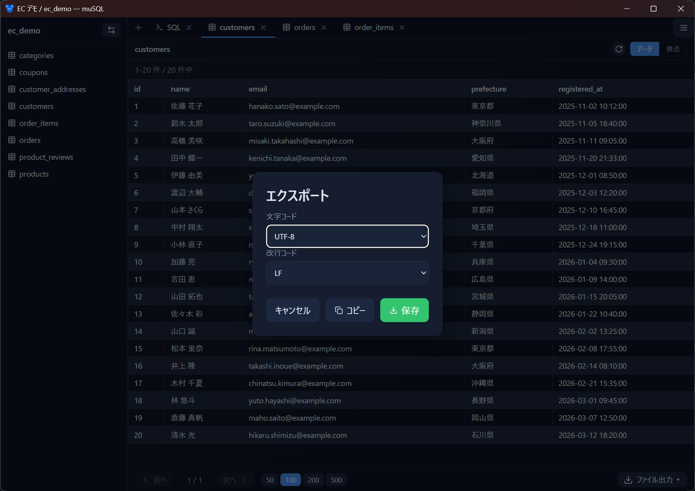

# エクスポート

クエリ結果やテーブルデータを、いくつかの形式でファイルに出力したりクリップボードにコピーしたりできます。

- [出力できる形式](#出力できる形式)
- [文字コードと改行コード](#文字コードと改行コード)
- [クリップボードにコピー](#クリップボードにコピー)
- [tbls 互換の Markdown](#tbls-互換の-markdown)

## 出力できる形式

Data タブや結果テーブルのフッターにある **エクスポート** から選べます。

| 形式 | 内容 |
|------|------|
| CSV | カンマ区切り |
| TSV | タブ区切り |
| SQL | `INSERT` 文（テーブルデータ。mysqldump 互換） |
| Markdown | tbls 互換のスキーマ Markdown（Schema ビュー） |

> **全行が対象**：画面上は 100 件ずつページングされますが、エクスポートは結果の**全行**を出力します。

## 文字コードと改行コード

<!-- 撮影: エクスポートで形式を選んだ後に出るオプションダイアログ。文字コード（UTF-8 / UTF-8(BOM) / Shift_JIS / EUC-JP）と改行コード（LF / CRLF）のプルダウン、保存 / コピー / キャンセルボタン。 -->

形式を選ぶと、オプションダイアログで **文字コード** と **改行コード** を指定できます。

- **文字コード**：UTF-8 / UTF-8（BOM 付き）/ Shift_JIS / EUC-JP
- **改行コード**：LF / CRLF

Excel で開く場合は Shift_JIS や UTF-8（BOM 付き）が扱いやすいことがあります。選んだ設定は次回の既定として記憶されます。

> Shift_JIS / EUC-JP に変換できない文字（絵文字など）は、数値文字参照に置き換わります。

## クリップボードにコピー

同じオプションダイアログの **「コピー」** で、ファイルに保存せずクリップボードへコピーできます。そのまま表計算ソフトやエディタに貼り付けられます（クリップボードはテキストのため、改行コードのみ適用されます）。

## tbls 互換の Markdown

Schema ビューのフッター、または Data ビューのエクスポートメニューから、[tbls](https://github.com/k1LoW/tbls) 互換のスキーマ Markdown を出力できます。テーブル定義・カラム・インデックス・制約・外部キーを含みます。

次のステップ: [クエリ画面](query.md) / [接続の同期](sync.md)
