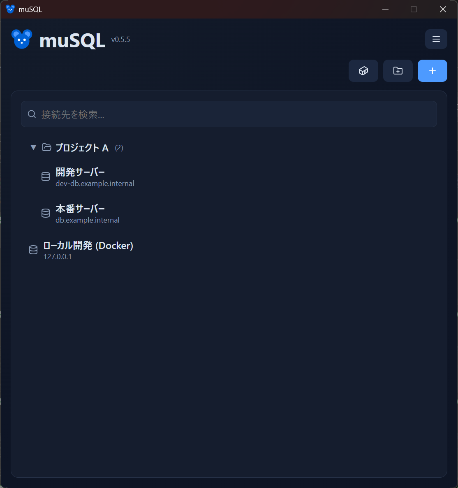
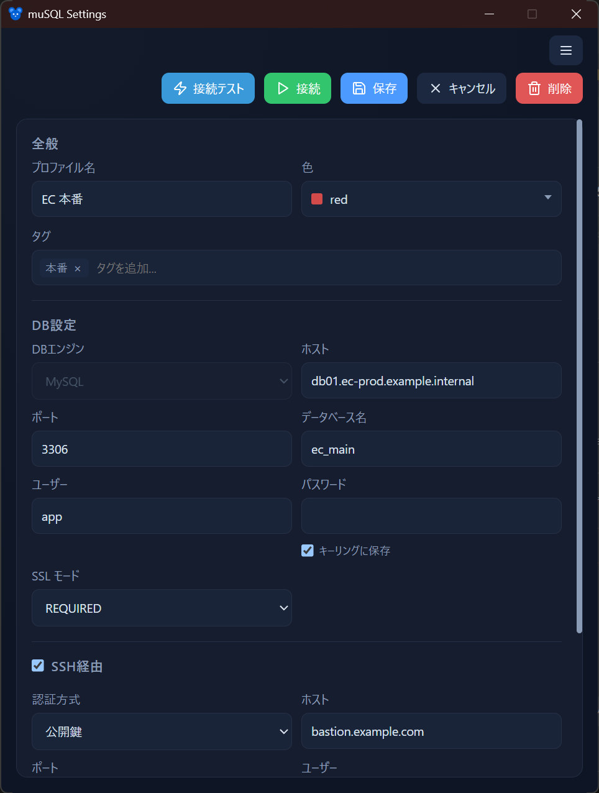

# はじめに

muSQL を初めて使うときの流れをまとめます。

- [インストール](#インストール)
- [初回起動](#初回起動)
- [画面構成](#画面構成)
- [最初の接続を作る](#最初の接続を作る)
- [接続してクエリを実行する](#接続してクエリを実行する)

## インストール

**[Microsoft Store](https://apps.microsoft.com/detail/9mvgmmcf47gj?hl=ja-JP&gl=JP) からのインストールを推奨します。** Microsoft による署名・自動更新・クリーンアンインストールに対応しています。

| 入手先 | 特徴 |
|--------|------|
| **Microsoft Store**（推奨） | 署名済み・自動更新・警告なし |
| [GitHub Releases](https://github.com/kan/musql/releases/latest) の `.exe` | アプリ内自動更新付き。未署名のため SmartScreen 警告が出る（「詳細情報」→「実行」） |

## 初回起動

初回は接続プロファイルが無いため、**空のメイン画面**で起動します。ここから接続先を登録していきます。

muSQL には 2 種類のウィンドウがあります。

- **メイン画面**：接続プロファイルの一覧。ここが起点です。
- **クエリ画面**：プロファイルを開くと表示される、テーブル閲覧と SQL 実行の画面。

設定（プロファイルの編集）は専用の設定ウィンドウで行います。

## 画面構成

<!-- 撮影: メイン画面。プロファイルが数件・グループが1つ、右上に Docker ボタン、右上のハンバーガーメニューが見える状態。各部を指し示せるよう全体が入るように。 -->

| 部位 | 役割 |
|------|------|
| **プロファイル一覧** | 登録した接続先。クリックで接続してクエリ画面を開く |
| **新規プロファイル / 新規グループ** | 接続先やグループを追加する |
| **Docker ボタン** | 起動中の Docker コンテナから MySQL を検出して接続する（→ [Docker 連携](docker.md)） |
| **ハンバーガーメニュー（≡）** | インポート / エクスポート、接続の同期、テーマ・言語、更新の確認など |

## 最初の接続を作る

<!-- 撮影: 設定ウィンドウ。ホスト/ポート/ユーザー/パスワード/データベース、SSL モードのプルダウン、SSH セクションが見える状態。適当なサンプル値を入れて。 -->

1. メイン画面の **「新規プロファイル」** を開く
2. 接続情報を入力する
   - **ホスト / ポート / ユーザー / パスワード / データベース**（MySQL の基本情報）
   - **SSL モード**：`DISABLED` / `REQUIRED` / `VERIFY_CA` / `VERIFY_IDENTITY` から選択
   - 必要なら **SSH 踏み台** を設定（→ [SSH 踏み台接続](ssh.md)）
3. **表示名や色、タグ** を付けて整理できる（→ [接続プロファイル](connections.md)）
4. **「接続テスト」** で疎通を確認し、**保存** する

> **パスワードの保存**：各パスワードは「保存する（Windows 資格情報マネージャーに保存）」か「都度入力」を選べます。都度入力にすると、接続前にプロンプトが表示されます。→ [接続プロファイル](connections.md#パスワードの保存方針)

## 接続してクエリを実行する

1. メイン画面でプロファイルをクリックすると **クエリ画面** が開きます
2. データベースを選ぶと、左に **テーブル一覧** が表示されます
3. テーブルをクリックすると **Data タブ**（データ）が開きます。**Schema** に切り替えると定義を確認できます
4. **SQL タブ**（`+`）で自由に SQL を書いて実行できます

詳しくは [クエリ画面](query.md) を参照してください。

次のステップ: [接続プロファイル](connections.md) / [クエリ画面](query.md)
