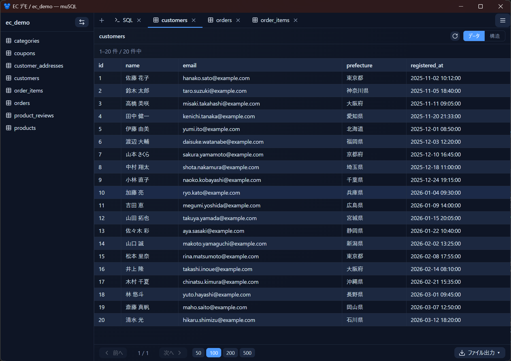
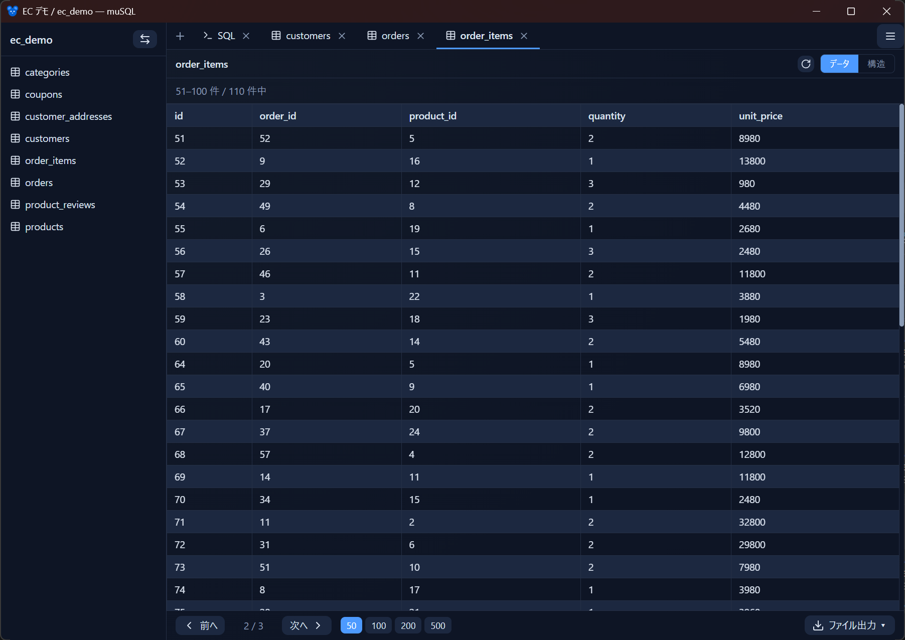
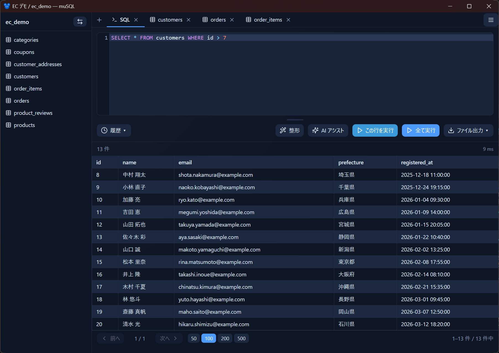
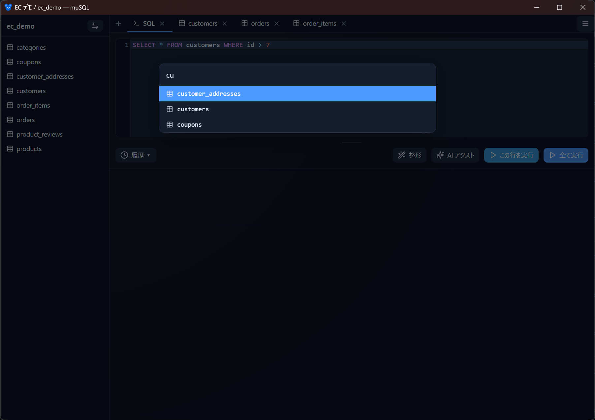

# クエリ画面

プロファイルを開くと表示される、テーブル閲覧と SQL 実行の中心画面です。

- [画面構成](#画面構成)
- [テーブル一覧とタブ](#テーブル一覧とタブ)
- [Data タブ（データ閲覧）](#data-タブデータ閲覧)
- [Schema タブ（定義）](#schema-タブ定義)
- [SQL タブ（自由記述）](#sql-タブ自由記述)
- [クエリ履歴](#クエリ履歴)
- [QuickOpen（Ctrl+P）](#quickopenctrlp)
- [長時間クエリの完了通知](#長時間クエリの完了通知)

## 画面構成

<!-- 撮影: query 画面全体。左サイドバー（DB名 + テーブル一覧）、上部タブバー（テーブルタブ + SQL タブ + ＋ボタン + ハンバーガー）、中央に結果テーブル。 -->

| 部位 | 役割 |
|------|------|
| 左サイドバー | 選択中のデータベース名と、テーブル一覧。上部の切替ボタンで DB を変更 |
| タブバー | テーブルの Data/Schema タブと SQL タブを扱う。`+` で SQL タブ追加、ドラッグで並べ替え |
| 結果エリア | アクティブなタブの内容（データ・定義・SQL とその結果） |

タブの状態（SQL の内容、開いているタブ、並び順、アクティブタブ）は自動保存され、次回開いたときに復元されます。

## テーブル一覧とタブ

- テーブルをクリックすると **Data タブ** が開きます。
- 右クリックから **Data / Schema** を選んで開くこともできます。
- タブは **右クリックメニュー**（閉じる / 他を閉じる / 右側を閉じる / すべて閉じる）で整理できます。
- タブは **ドラッグで並べ替え** できます。

## Data タブ（データ閲覧）

<!-- 撮影: テーブルの Data タブ。結果テーブルに数十行、下部にページング（前へ/次へ・50/100/200/500・件数）。 -->

- **ページング**：既定 100 件/ページ。フッターで 50 / 100 / 200 / 500 を切り替えられます。
- **ソート**：列見出しをクリックで昇順 → 降順 → 解除。
- **行詳細**：行をクリックすると全カラムを縦並びで表示するモーダルが開きます（長い値や JSON は整形表示）。
- **エクスポート**：フッターのエクスポートから CSV / TSV / SQL / Markdown 出力（→ [エクスポート](export.md)）。

## Schema タブ（定義）

テーブルの列定義、インデックス、制約などの構造を確認できます。フッターから **tbls 互換の Markdown** をエクスポートすることもできます。→ [エクスポート](export.md)

## SQL タブ（自由記述）

<!-- 撮影: SQL タブ。上部にエディタ（SELECT 文）、下部に結果テーブル、実行/全実行/整形などのボタンが見える状態。 -->

`+` で SQL タブを追加し、自由に SQL を書いて実行できます。

- **この行を実行 / すべて実行**：カーソル位置の 1 文、または全文を実行します。
- **キャンセル**：実行中のクエリはタブ単位でキャンセルできます（`KILL QUERY`）。
- **整形**：SQL を自動整形します。
- **結果のページング**：結果は画面上でページングされ、[エクスポート](export.md) では全行が対象になります。
- **エラー表示**：構文エラーは該当箇所をハイライトします。

## クエリ履歴

実行した SQL はデータベースごとに履歴として保存されます（最新順、上限あり）。履歴ボタンから呼び出してエディタに挿入できます。[QuickOpen](#quickopenctrlp) の `>` モードからも検索できます。

## QuickOpen（Ctrl+P）

<!-- 撮影: Ctrl+P で開いたパレット。入力欄 + 候補リスト。テーブル名で絞り込んでいる状態が分かりやすい。 -->

`Ctrl+P` でコマンドパレットが開きます。**先頭の文字でモードが切り替わります**。

| 入力 | モード | 動作 |
|------|--------|------|
| （そのまま） | テーブル検索 | あいまい一致で絞り込み、選択で Data タブを開く |
| `@` | タブ切替 | 開いているタブを検索して切り替える |
| `>` | SQL 履歴 | 履歴を検索して、アクティブな SQL エディタに挿入 |
| `?` | ヘルプ | モード一覧を表示 |

矢印キーで移動、`Enter` で決定、`Esc` で閉じます。

## 長時間クエリの完了通知

実行時間が **5 秒を超える**クエリが、**ウィンドウが非フォーカスのとき**に完了（成功でも失敗でも）すると、デスクトップ通知でお知らせします。重いクエリを投げて他の作業をしていても、完了に気づけます。

- ON / OFF はクエリ画面のメニュー（View →「クエリ完了を通知」）で切り替えられます。
- Windows では、通知のクリックでウィンドウを前面化する動作には対応していません（通知の表示のみ）。

次のステップ: [AI アシスト](ai-assist.md) / [エクスポート](export.md)
