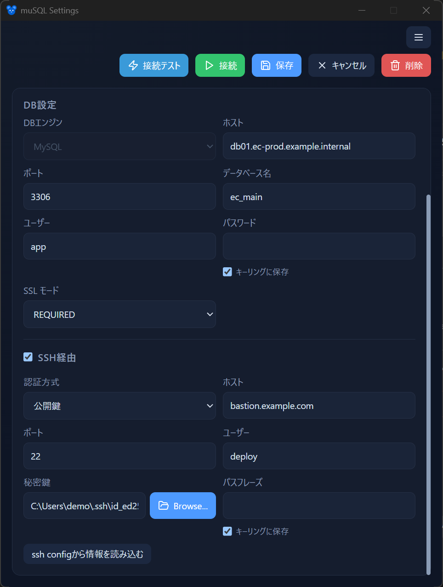

# SSH 踏み台接続

muSQL は **SSH 踏み台（bastion）経由** で MySQL に接続できます。純 Rust の `russh` 実装を使うため、`ssh.exe` は不要です。

- [概要](#概要)
- [認証方式](#認証方式)
- [SSH Agent と config](#ssh-agent-と-config)
- [パスフレーズ / パスワードの入力](#パスフレーズ--パスワードの入力)

## 概要

SSH 踏み台を有効にすると、muSQL はまず踏み台サーバーへ SSH 接続し、その先から MySQL へトンネルを張ります。プロファイルの MySQL ホスト／ポートは **踏み台から見たアドレス**（多くは `127.0.0.1:3306` や社内ホスト名）を指定します。

<!-- 撮影: 設定ウィンドウの SSH セクション。踏み台ホスト/ポート/ユーザー、認証方式（公開鍵/パスワード）の切替、鍵パス、config 参照のあたり。 -->

- 接続タイムアウトは 8 秒です。
- 一度確立した接続（プール + トンネル）は再利用され、同じ設定なら再接続を省略します。

## 認証方式

SSH の認証方式は **公開鍵** または **パスワード** を選べます。

- **公開鍵**：指定した秘密鍵 → SSH Agent → デフォルト鍵（`~/.ssh/id_*`）の順に試します。
- **パスワード**：踏み台サーバーへパスワードで認証します。

## SSH Agent と config

- **SSH Agent**：1Password などの Agent に登録された鍵を利用できます。
- **`~/.ssh/config`**：ホストのエイリアスを参照できます。config を参照する場合、認証方式は公開鍵に固定されます。

`~/.ssh/config` の `Host` エントリを指定すると、ホスト名、ユーザー、鍵、ポートなどを config 側の設定から解決します。

## パスフレーズ / パスワードの入力

SSH の **パスフレーズ**（鍵の暗号化解除）と **パスワード**（パスワード認証時）は、それぞれ次のいずれかを選べます。

- **保存する**：Windows 資格情報マネージャーに保存し、次回以降は自動で使います。
- **都度入力**：接続前にプロンプトを表示します。

保存方針の考え方は [接続プロファイル](connections.md#パスワードの保存方針) と同じです。

次のステップ: [接続プロファイル](connections.md) / [クエリ画面](query.md)
