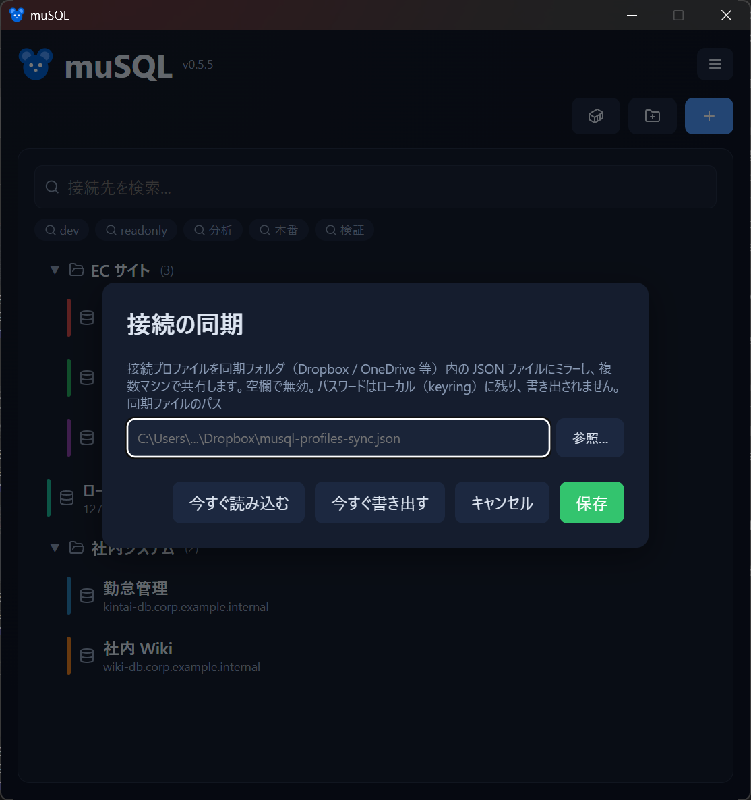

# 接続の同期

接続プロファイルを、Dropbox / OneDrive などの**同期フォルダ内の JSON ファイル**にミラーして、複数マシン間で共有できます。

- [設定](#設定)
- [動作](#動作)
- [同期されるもの・されないもの](#同期されるものされないもの)
- [注意点](#注意点)

## 設定

<!-- 撮影: メイン画面のメニュー →「接続の同期…」で開くモーダル。同期ファイルのパス入力欄 + 参照ボタン、今すぐ読み込む / 今すぐ書き出す / 保存ボタン。 -->

1. メイン画面のハンバーガーメニュー（≡）→ **「接続の同期…」** を開く
2. **同期ファイルのパス** を指定する（「参照…」で保存ダイアログから選択、または直接入力）
   - 例：`C:\Users\you\Dropbox\musql-profiles-sync.json`
3. **保存** すると、その時点のプロファイルが同期ファイルに書き出されます

パスを空にして保存すると、同期は無効になります。

## 動作

- **書き出し（自動）**：プロファイルを変更するたびに、同期ファイルへ自動でミラーされます。
- **取り込み**：アプリ起動時、メイン画面がフォーカスされたとき、「今すぐ読み込む」で、同期ファイルを読み込んで反映します。
- **マージ方式**：同じプロファイル（ID 一致）はファイル側を優先し、ローカルにしか無いものは残します。ただし後述の**ファイルパス設定はマシンごとの値が保たれます**。

別のマシンで編集した内容は、こちらのマシンをフォーカスしたときに取り込まれます。

## 同期されるもの・されないもの

**同期されるもの**：プロファイル名、グループ、並び順、色、タグ、ホスト、ポート、データベース名、ユーザー名、SSL モード、SSH の接続先（ホスト / ポート / ユーザー名 / `~/.ssh/config` のホスト別名）、認証方式、パスワードを保存するかどうかの設定、[1Password の参照文字列](1password.md)（`op://…`。パスワードそのものではなく、その置き場所を指す文字列）。

**同期されないもの**：

- **パスワードと SSH の秘密情報**。同期ファイルには書き出されず、各マシンの資格情報マネージャーに残ります。同期先で改めてパスワードを入力するか、そのマシンの資格情報マネージャーに保存されたものが使われます。
- **ファイルパスを指す設定** — SSH の秘密鍵ファイル、SSL の CA 証明書ファイル。これらはマシンごとに置き場所が違うため、各マシンで個別に指定します。別のマシンで鍵のパスを変更しても、こちらのマシンの設定は上書きされません。

新しいプロファイルを別のマシンから受け取ったときは、秘密鍵や CA 証明書のパスが空になっています。SSH や SSL 検証を使うプロファイルでは、[接続設定](settings.md)で指定し直してください。

パスワードは同期されませんが、[1Password 連携](1password.md)を設定しておくと、同期先のマシンでも最初の接続時に自動で取得されます。

## 注意点

- **削除は伝播しません**。あるマシンでプロファイルを削除しても、まだそれを持つ別のマシンから復活することがあります。不要なプロファイルは各マシンで削除してください。
- 競合時は「ファイル優先のマージ」＝実質的に**後から書き込んだ側が勝つ**方針です。1 台ずつ順番に使う運用（同時編集をしない）で最もうまく機能します。
- 色や並び順、グループも同期対象です（マシンごとの見た目の差は保てません）。
- 同期ファイルは共有フォルダに置かれる前提のため、取り込み時にパスワード類は読み捨てられます。ファイルを手で編集してパスワードを書いても反映されません。
- **同期するマシンは揃えて更新してください**。ファイルパスを同期対象から外したのは v0.6.0 より後です。片方だけを更新すると、古いバージョンのマシンが新しい同期ファイルを読んだときに、自分の秘密鍵・CA 証明書のパスを空で上書きしてしまいます。
- 更新前の同期で他マシンのパスに書き換わってしまったプロファイルは、自動では直りません。設定画面で指定し直してください。
- **新しいバージョンで書かれた同期ファイルは、古いバージョンでは上書きしません**。同期ファイルには最後に書き込んだ muSQL のバージョンが記録され、自分より新しいバージョンで書かれていた場合は書き出しを行いません（新しいバージョンが増やした項目を、古いバージョンが知らずに削ってしまうのを防ぐためです）。「今すぐ書き出す」を押した場合はその旨の警告が表示されます。この保護が働くのは双方が本機能を含むバージョンのときなので、やはりマシンは揃えて更新するのが確実です。

次のステップ: [接続プロファイル](connections.md) / [設定](settings.md)
